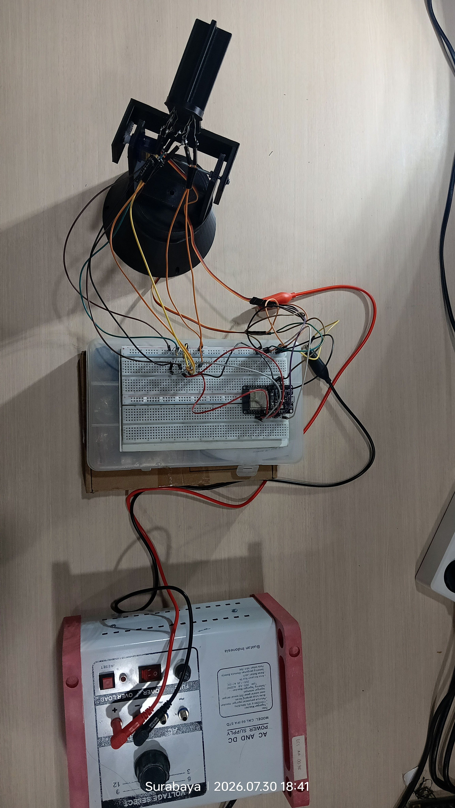
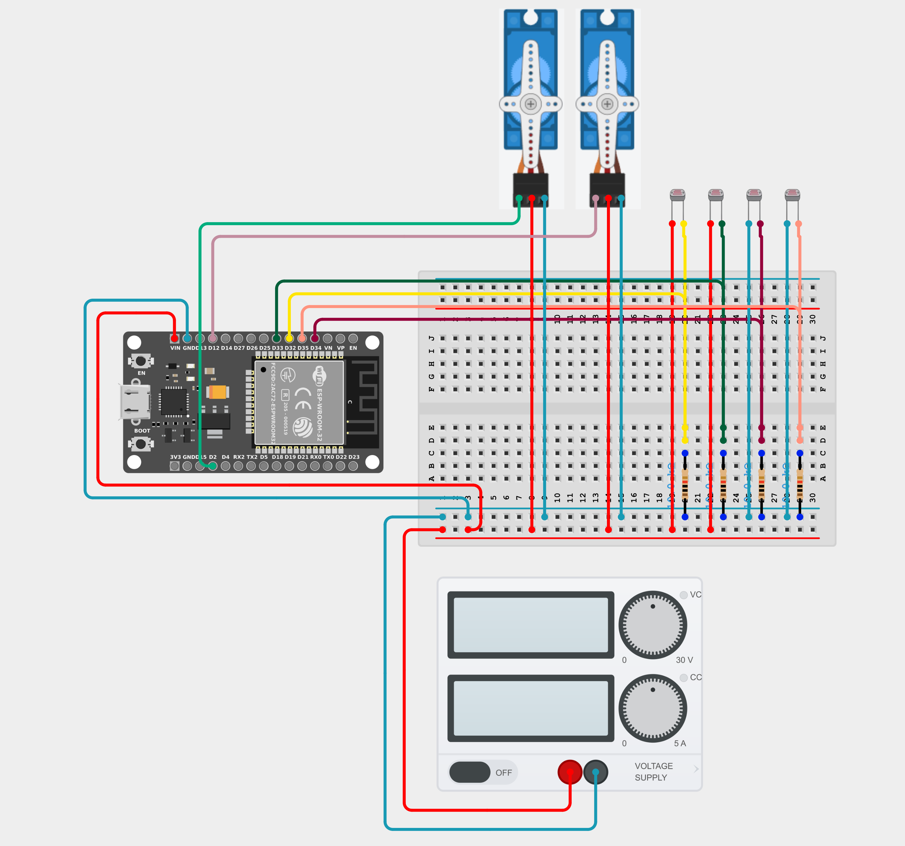
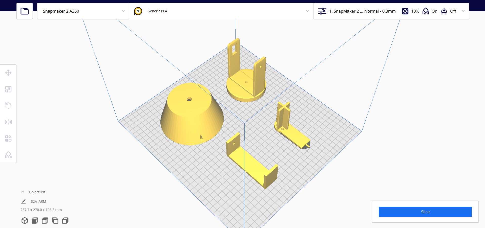

# ☀️ Dual-Axis Light Tracking System

> An intelligent, highly responsive dual-axis solar/light tracker powered by ESP32. It actively hunts for the brightest light source in its environment using a 4-LDR sensor array and a custom 3D-printed pan-tilt mechanism.

---

## 📸 Documentation Gallery

Here is a look at the final build and the mechanics behind it:

  <!-- GANTI LINK GAMBAR DI BAWAH INI DENGAN LINK FOTO ASLI ANDA -->
  
  
  

<i>(Left to right: Final Assembly, Wiring Diagram, 3D Printed Pan-Tilt Mechanism)</i>

---

## ✨ Features
* **Dual-Axis Tracking:** Moves both Horizontally (Pan) and Vertically (Tilt) for maximum efficiency.
* **ESP32 Powered:** Utilizes 12-bit ADC resolution (0-4095) for ultra-precise light detection compared to standard Arduino (10-bit).
* **Hardware-Safe Code:** Built-in mechanical limits and optimized delay timings to prevent servo stalling and jittering.
* **Modular Design:** Housed entirely in a custom-designed 3D-printed chassis.

---

## 🛠️ Components Used

### Electronics
| Qty | Component | Description |
|:---:|:---|:---|
| **1** | **ESP32 Development Board** | The main brain of the system. |
| **2** | **Servo Motors** | SG90 or MG996R (1 for Horizontal, 1 for Vertical). |
| **4** | **Photoresistors (LDR)** | Light-dependent resistors for the sensor array. |
| **4** | **10kΩ Resistors** | Used as voltage dividers for the LDRs. |
| **1** | **External Power Supply** | 5V Power source dedicated to the servos to prevent ESP32 brownouts. |
| **-** | **Jumper Wires & Breadboard** | For circuit connections. |

### 🧊 3D Printed Parts
The physical structure is 100% 3D printed. *(You can find the STL files in the `/3D_Models` folder).*
* 🟦 **Base Mount:** The main stand holding the horizontal servo.
* 🟦 **Pan Bracket (U-Bracket):** Connects the horizontal servo to the vertical servo.
* 🟦 **Sensor Platform:** The flat surface where the LDRs are mounted.
* 🟦 **Light Separator (Cross Divider):** Crucial part placed between the 4 LDRs to cast shadows, allowing the system to detect light direction differences.

---

## 🔌 Pinout Configuration

### Servo Motors
| Servo | ESP32 Pin | Note |
|---|:---:|---|
| **Horizontal (Pan)** | `GPIO 2` | Move Left/Right |
| **Vertical (Tilt)** | `GPIO 12` | Move Up/Down |

### Sensor Array (LDRs)
*Using ADC1 pins to avoid Wi-Fi driver conflicts on the ESP32.*
| Position | ESP32 Pin |
|---|:---:|
| **Top Left** | `GPIO 32` |
| **Top Right** | `GPIO 33` |
| **Bottom Left** | `GPIO 34` |
| **Bottom Right**| `GPIO 35` |

---

## 🚀 How to Run

1. **Wiring:** Connect all components according to the Pinout table. **Crucial:** Ensure the servos are powered by an external 5V source, and connect the external `GND` to the ESP32 `GND`.
2. **Library Setup:** Install the `ESP32Servo` library in your Arduino IDE.
3. **Upload:** Flash the provided `main.ino` code to your ESP32. 
4. **Calibrate (If Needed):** Open the Serial Monitor (`115200` baud). If the tracker moves away from the light instead of towards it, simply swap the `++` and `--` operators in the Horizontal/Vertical correction logic in the code.

---
*Built with passion and lots of tea 🍵 by [Andre/jackthedoq]*
